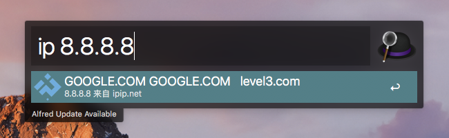
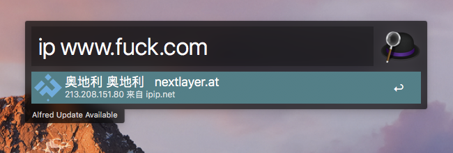

# alfred-workflow-ipip

API documentation [ipip.net](https://www.ipip.net/support/api.html)

## use

ip 8.8.8.8

ip www.fuck.com

## download

[ipip.alfredworkflow](https://github.com/Demired/ipip-alfred-workflow/releases/download/v1.0/ipip.alfredworkflow)

## example

